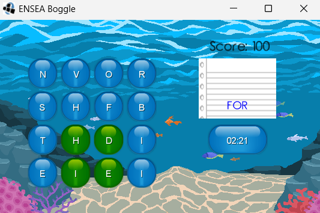

## Boggle Clone for ENSEA 2025

This application is a simple Java version of the board game Boggle, created with LibGDX.

In this game, you search for words using various random letters on the board, and find as many words as you can under a certain time limit.

### Run Instructions

To run this application, first clone this repository or download the `boggleprototype-desktop-1.0-SNAPSHOT-jar-with-dependencies.jar` file in the `/dist` directory.

Then, run the command `java -jar your/path/to/the/jar/here/boggleprototype-desktop-1.0-SNAPSHOT-jar-with-dependencies.jar`

If the application does not start, there may be a compatibility issue with your Java version.